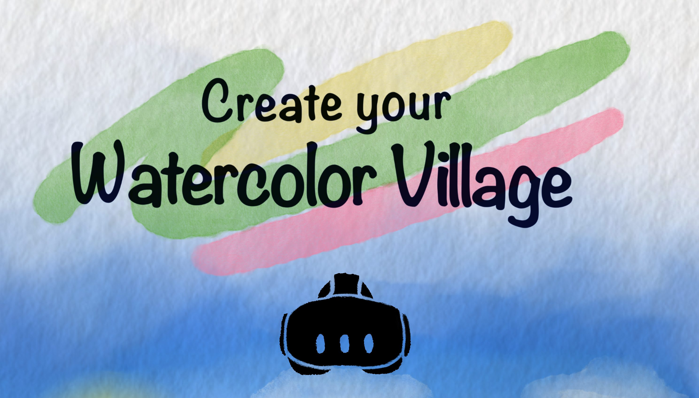
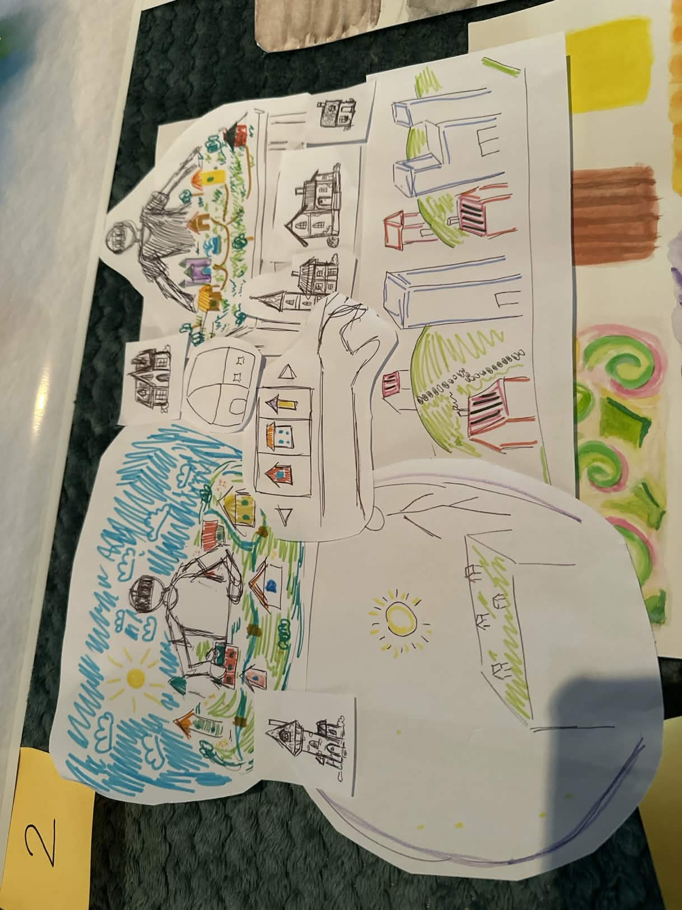
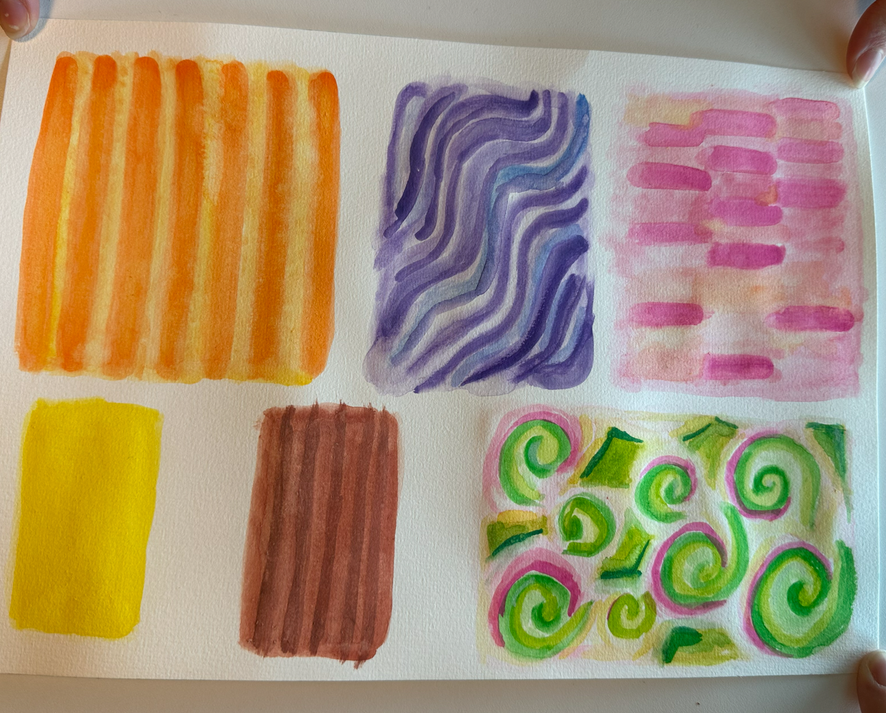
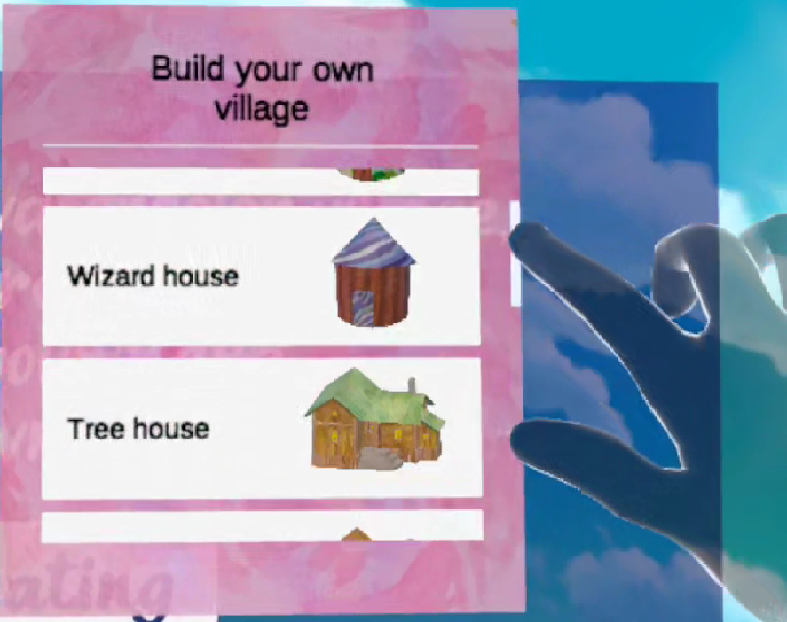
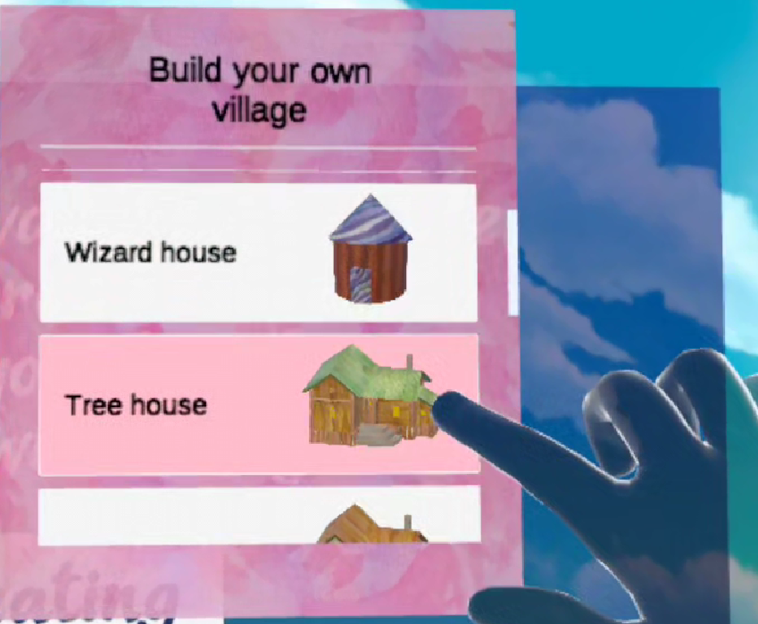
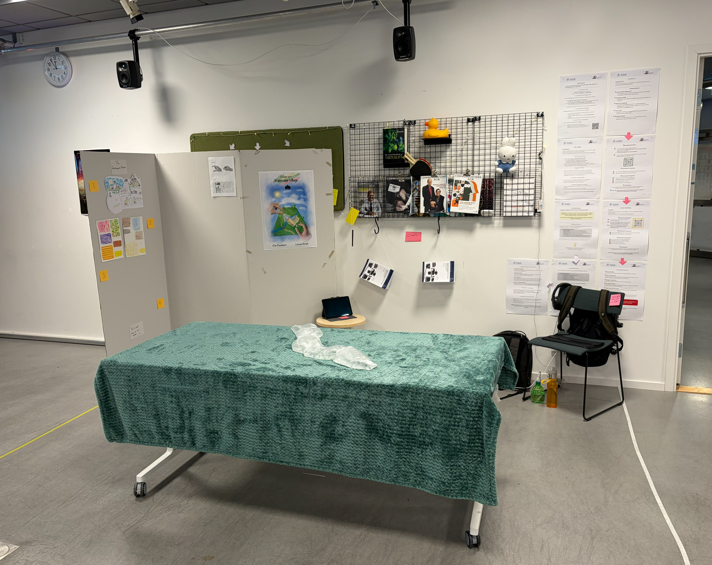
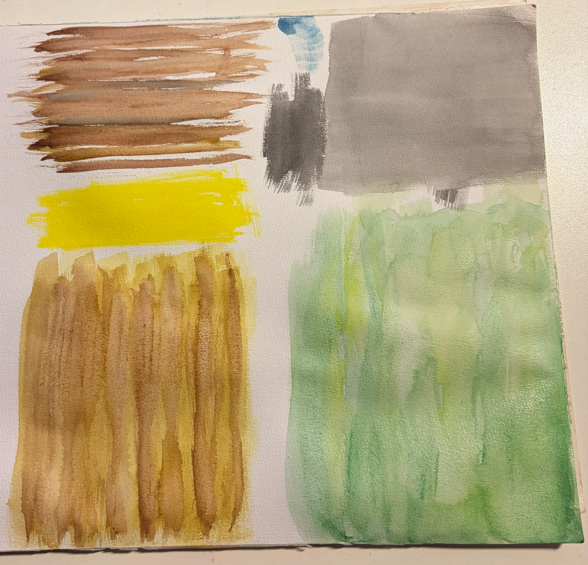
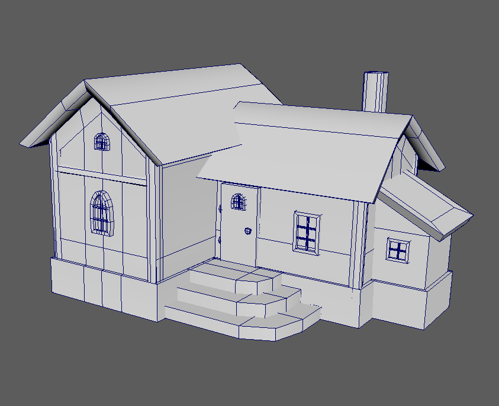
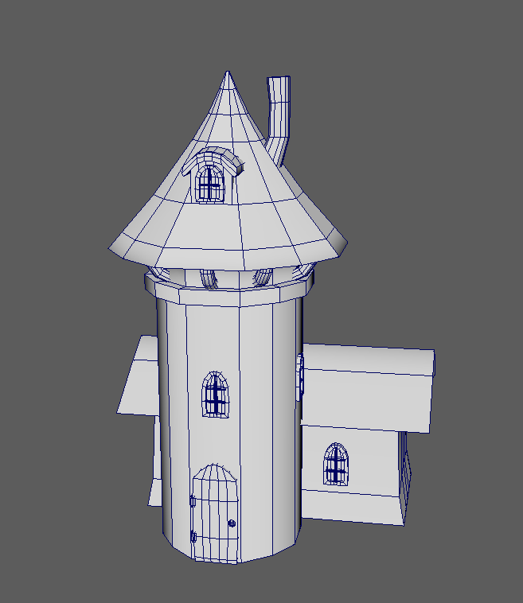

 The git repository contains a comprehensive README file describing the design, digital, and
tangible aspects to reproduce the project in the future (see example README on nextiLearn).

Include the name, logo and images refering to your project

## Watercolor Village

## Introduction (Elin fixar)

Create your WaterColor Village makes you feel like a giant building your own settlement. 
Set your own goal in this calm and cozy sandbox environment with cute sheeps and watercolored houses.
This will be especially fun in VR beacuse you interact with everything directly with your hands. 
For example when placing and scaling the houses. And it feels like you're a giant making your own world.

[Project XR ] is an educational XR experience that lets you explore in 3D [...] . Learn about [...].

The problem detected was...

The proposed solution is valuable because...

## Design Process (Elin skriver)

[_Add evidence on the general overview of how you planned, designed, and developed your project, including the goals, challenges, and solutions._]
The goal was to create a VR experience where the user would feel calm and creative in a sandbox environment. 
For example:
1. Firstlty sketches was done based on our ideas (see picture).
  
3. A moodboard was made to get a overvierw over the mood, color and vision of our project (see picture).
5. Target user was identifed: poeple who likes to be creative.
6. 3D models were made using a program called Maya (see picture).
7. Handpainted watercolor textures were created and applied on the 3D houses (see picture below).

    
    
    
8. The overall mechanics of the VR experience were developed from grab interactions, resizing of the houses, skybox timer etc.
9. A poster was made to represent the experience (see picture below).
10. 
   

   
- Brainstorming: A screenshot of the whiteboard or post-it notes used to land the project's idea.
- User Research: Pictures and summary of how you conducted user research, such as surveys, interviews, or observations, and what insights you gained from it.
- User Persona: A description of your target user, their needs, motivations, and pain points, and how your project addresses them.
- User Journey: A visualization of how your user interacts with your project, from the initial trigger to the final outcome, and what emotions they experience along the way.
- Wireframes and Prototypes: A collection of sketches, mockups, or prototypes that show the layout, structure, and functionality of your project, and how you tested and iterated on them.

## System description

### Features (Linnea skriver)

-	A day cycle of four minutes that start at the morning and ends at night. With changing sky material.
-	Multiple sheep walking around the world. 
-	A menu on your wrist that you can open and close. You can select objects to place in the world. The menu can be accessed with either hand, so it works for both left and right-handed people.
-	The object appears in front of you; you can grab it by pinching. 
-	The objects can be sized (there is a maximum size and a minimum size) through pinching the two globs at each end and dragging your hands away from each other for the object to become larger or together for it to become smaller.
-	If objects are thrown off the table, they get deleted from the scene.
-	There is a tangible button for restarting the scene without having to leave it.
-	It is a start button that the user clicks in the beginning to start the cycle. They can click it through either poking or using ray casting. 
-	Most of the 3D objects and materials are made by the creators. Through painter materials using watercolour in real life, and using Maya to 3D model the houses and sheep.
-	Interactive and intuitive controls using hand gestures for interaction (can be used with controllers if the user wants that too).
-	Sound on the most important interactions, such as selecting a house from the menu, and also calming background sounds to add to the feeling of the experience.
-	A real-life table that matches the in-VR world so the user can touch it and comfortably walk around it.
-	A blanket on the table for the texture of grass and bags with water in them, plus water sprayed on them, to get the feeling of the river. This is for the user to be able to really feel like they are in that world. 
-	Noise-cancelling headphones to make the user feel more immersed and calmer.
-	Compatible with various VR headsets. We used a Meta Quest 3.

Watch the demo video!
Link: <https://drive.google.com/file/d/1Xnq1DW26jSc7_4_tUwSsEwHMrZ1NvsP-/view?usp=sharing>

Check out the courses website!
Link: <https://extralitylab.dsv.su.se/>

Images from the project:

## Installation (Linnea skriver)

To install and run Watercolor Village on your platform or device, follow the instructions below:

| Platform | Device | Requirements | Commands |
| -------- | ------ | ------------ | -------- |
| Windows  | Meta Quest | Unity version 6000.3.0f1 or higher, Arduino | `git clone https://github.com/L77B/DET_Group_project_2.git ` `cd project-xr` `open VilageBuilder.unity` `Build and Run` |

You also need to install the following dependencies or libraries for your project:

Package from Louis Quintero:
- Packages - ExtralityLab@DSV for websockets and XR-introduction.

Packages from Asset store:
- Packages - DEMO: Low Poly Flower Pack for flowers in the scene.
- Packages - Fantasy Skybox FREE for the sky materials.
- Packages - Nature Pack - Low Poly Trees & Bushes for the trees.

## Usage (Elin skriver)

[_Usage section showing how to use your project and interact with its features. You can use examples, screenshots, gifs, or videos to demonstrate the user interface, controls, and feedback of your project. You can also provide tips, tricks, or best practices for using your project effectively._]

To use [Your App XR} and interact with its features, follow the guidelines below:

- To move around, use the touchpad or the joystick on your controller, or swipe on your phone screen.
- To select ...a planet or a moon, point at it with your controller or your phone, or gaze at it with your headset.
- To zoom in or out, use the trigger or the button on your controller, or pinch on your phone screen.
- To access the information panel, press...
- To use voice commands, say "OK" followed by one of the following phrases:
  - "Show me [X]" - to show X element
  - "Close window Y" - to close window Y
  
Some tips, tricks, and best practices for using [Your App XR} effectively:

- Tip 1
- Tip 2

## References

Acknowledge here the sources, references, or inspirations that you used for your project. Give credit to the original authors or creators of the materials that you used or adapted for your project (3D models, source code, audio effects, etc.)

inspiration for the project:
- Sims
- Minecraft
- Studio Ghibli
- Moomin
- Animal Crossing

## Contributors

The authors of the project, contact information, and links to their websites or portfolios.

Linnea Bergh - libe0812@student.su.se
